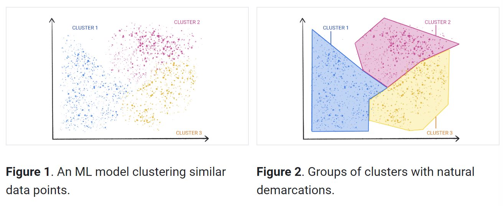
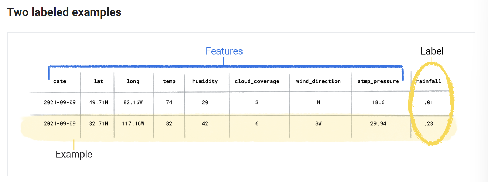
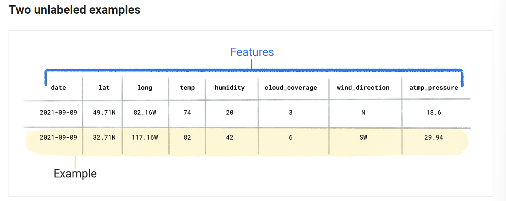

## What is Machine Learning?
### Introduction
- ML -> training a model to make useful predictions from data
- A model is a mathematical relationship from data that an ML system uses to make predictions

### Types of ML Systems
####  Supervised learning
- Makes predictions after seeing a lot of data and correct answers (to that data) and makes connections between the data and the elements that produce correct answers

- 2 most common cases:
    - Regression -> numeric value
    - Classification -> predicts the likelihood that something belongs to a category (instead of numeric value, it outputs something similar to boolean (example: "rain" or "no rain"))

#### Unsupervised learning
- Makes predictions with data that doesn't have a correct answer

- Cluster vs classification -> clusters aren't defined by us, but by the AI, we can name the clusters after the AI has created them 

#### Reinforcement learning
- Makes predictions by getting rewards or penalties based on actions performed
- Usually used to train robots (walking) or software playing a game (but is slowly expanding)

#### Generative AI
- Creates content from user input
- Example: writings, images, jokes, etc
- Inputs and outputs can be of various forms

- Types of inputs/outputs:
    - Text-to-text
    - Text-to-image
    - Text-to-video
    - Text-to-code
    - Image-to-text

- How does it work?
    - Learns patterns in data with the goal to produce new but similar data
    - Usually start by being trained with the unsupervised approach, then might be trained further with the supervised or reinforcement approach 

## Supervised Learning
### Core Concepts:
#### Data:
- Related data is stored in datasets
- Datasets are made up of individual examples
- Two labeled examples (include both features and labels):

- Two unlabeled examples(only includes features):

- A dataset's size indicates the number of examples; a dataset's diversity indicates the range the examples cover

#### Model:

#### Training:

#### Evaluating:

#### Inference: